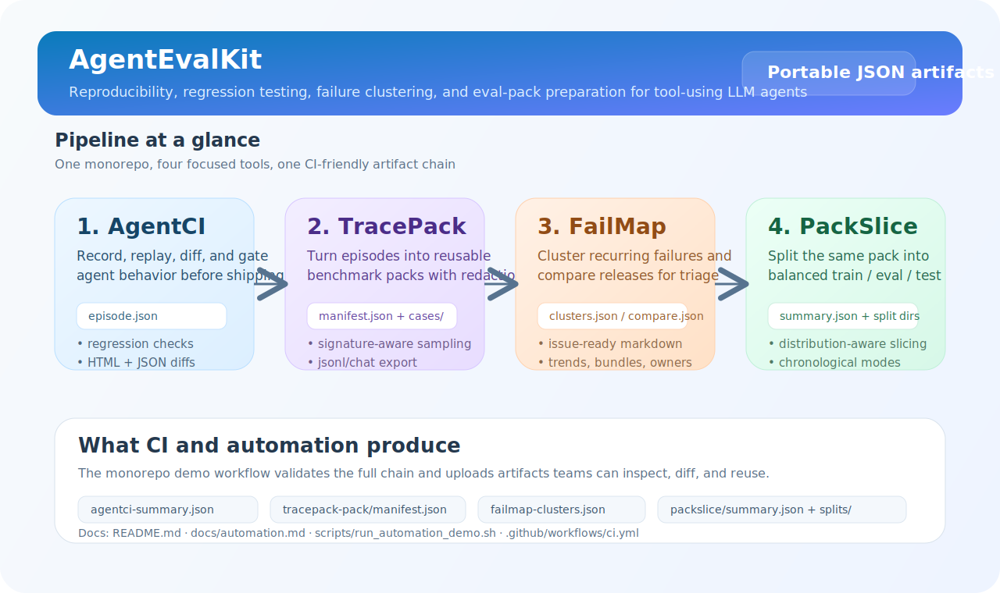
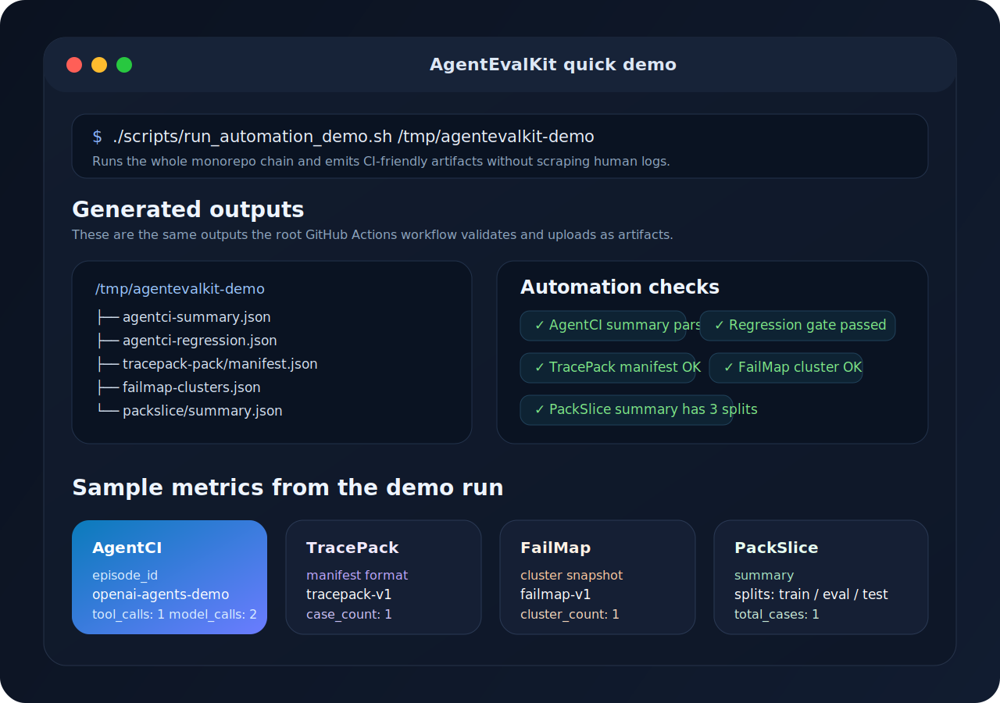

# AgentEvalKit

[](https://github.com/Jasvina/AgentEvalKit/actions/workflows/ci.yml)
[](LICENSE)
[](https://github.com/Jasvina/AgentEvalKit)

Open-source tooling for agent evals, regression testing, trace packaging, failure clustering, and dataset slicing.

`AgentEvalKit` is a focused monorepo for a specific gap in the LLM agent stack: teams can build agents, but still struggle to replay failures, turn real traces into reusable eval assets, cluster recurring failure modes, and produce stable train/eval/test slices from the same evidence.

## Why this exists

A lot of agent repos optimize for demos, orchestration, or UI. Fewer repos help with the reliability loop after a run goes wrong.

This repo is built around that loop:

1. capture a real run
2. replay or diff it in CI
3. package it into a reusable eval artifact
4. cluster repeated failures across runs or releases
5. slice the same artifact into reproducible datasets

That makes `AgentEvalKit` closer to an eval-and-reliability toolkit than a general agent framework.

## What you get

- `AgentCI` for replay-first regression testing of tool-using agents
- `TracePack` for turning real traces into reusable benchmark packs
- `FailMap` for clustering recurring failures and comparing releases
- `PackSlice` for balanced train/eval/test splits from the same pack
- a root automation flow that proves the whole chain works together

## Toolchain at a glance

<p align="center">
  
</p>

```text
AgentCI   -> record and diff trajectories
TracePack -> turn trajectories into reusable benchmark packs
FailMap   -> cluster failures, compare releases, generate triage issues, bundle work
PackSlice -> split packs into balanced train/eval/test datasets
```

## What the demo produces

<p align="center">
  
</p>

Run the end-to-end repo demo with:

```bash
./scripts/run_automation_demo.sh /tmp/agentevalkit-demo
```

The output is intentionally machine-readable. A successful run gives you a root `manifest.json` plus per-tool artifacts:

```text
manifest.json
agentci-summary.json
agentci-regression.json
tracepack-scan.json
tracepack-build.json
tracepack-inspect.json
tracepack-pack/
  manifest.json
  cases/
failmap-cluster.json
failmap-clusters.json
failmap-summary.json
packslice-split.json
packslice-summary.json
packslice/
  summary.json
  train/
  eval/
  test/
```

The root `manifest.json` is the single best entrypoint for CI jobs, dashboards, or downstream automation that needs to discover the whole artifact set.

## Quick start

### AgentCI

```bash
cd projects/agentci
python -m venv .venv
source .venv/bin/activate
pip install -e .
python examples/math_agent.py
agentci diff examples/math_episode.json examples/math_episode_candidate.json
agentci diff-html examples/math_episode.json examples/math_episode_candidate.json examples/math_diff.html
agentci assert-regression examples/math_episode.json examples/math_episode_latency_candidate.json --ignore-diff-prefix metric:latency_ms
agentci detect-flaky examples/math_episode.json examples/math_episode_latency_candidate.json examples/math_episode_candidate.json
```

### TracePack

```bash
cd projects/tracepack
python -m venv .venv
source .venv/bin/activate
pip install -e .
python examples/make_sample_episodes.py
tracepack scan examples/source_episodes --json
tracepack build examples/source_episodes examples/demo_pack --only-failures --redact --max-per-signature 1
tracepack inspect examples/demo_pack --json
```

### FailMap

```bash
cd projects/failmap
python -m venv .venv
source .venv/bin/activate
pip install -e .
failmap compare examples/baseline_clusters.json examples/candidate_clusters.json examples/compare.json
failmap issue-drafts examples/compare.json examples/issues --rules examples/triage_rules.json
failmap issue-bundle examples/issues examples/bundle
failmap compare-summary examples/compare.json --json
```

### PackSlice

```bash
cd projects/packslice
python -m venv .venv
source .venv/bin/activate
pip install -e .
packslice split examples/sample_pack examples/split_demo --group-by signature
packslice summarize examples/split_demo --json
packslice markdown examples/split_demo examples/split_demo/REPORT.md
```

## JSON-first workflow

All four tools support machine-readable CLI output, so they can be chained in CI without scraping terminal prose:

```bash
agentci summarize projects/agentci/examples/math_episode.json --json
tracepack scan projects/tracepack/examples/source_episodes --json
failmap summarize projects/failmap/examples/clusters.json --json
packslice summarize projects/packslice/examples/split_demo --json
```

That is the core design choice of the repo: artifacts first, dashboards and release checks second.

## Projects

### 1. AgentCI

Path: `projects/agentci`

Replay-first regression testing for tool-using LLM agents, with portable episode traces, HTML diff reports, and pytest-friendly regression assertions.

### 2. TracePack

Path: `projects/tracepack`

Build reusable benchmark packs from real agent traces, with recursive redaction, case labels, jsonl/chat export, and signature-aware sampling for eval pipelines.

### 3. FailMap

Path: `projects/failmap`

Cluster recurring agent failures from TracePack packs, compare releases, generate issue-ready triage drafts with rules-driven routing, bundle them for planning, and track failure trends across snapshots.

### 4. PackSlice

Path: `projects/packslice`

Create balanced train/eval/test splits from TracePack packs with distribution-aware, label-aware, and chronological slicing modes.

## Why this repo can be valuable

The most useful agent infra repos are usually:

1. painkiller products, not toy abstractions
2. compatible with existing stacks
3. demoable in a few minutes
4. useful to both researchers and production teams

`AgentEvalKit` is built around that rule.

## Monorepo structure

```text
projects/
  agentci/    replay-first regression testing
  tracepack/  trace-to-benchmark packaging
  failmap/    failure clustering and release comparison
  packslice/  balanced dataset splitting for trace packs
.github/
  workflows/  monorepo CI
```

## Docs and contribution entrypoints

- repo-level walkthrough: `docs/automation.md`
- contributor guide: `CONTRIBUTING.md`
- issue and PR templates: `.github/`
- security policy: `SECURITY.md`
- support guidance: `SUPPORT.md`
- public roadmap: `ROADMAP.md`
- discussions: GitHub Discussions

## Roadmap

For the longer view, see `ROADMAP.md`.

- add more `AgentCI` integrations and richer HTML diff reports
- strengthen `TracePack` redaction policies, labeling workflows, and export formats
- add richer `FailMap` issue templates, trend views, and release-to-release drilldowns
- expand `PackSlice` with temporal and label-aware slicing
- add more focused projects around agent eval infra, failure mining, and trajectory analytics

## License

MIT
