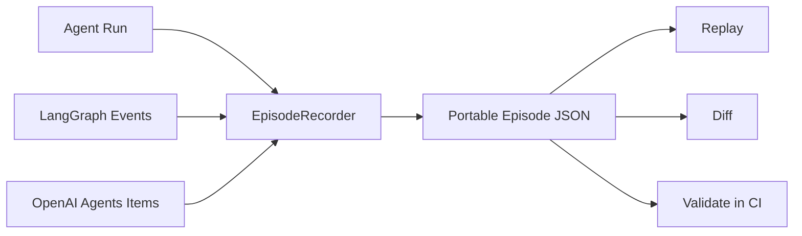

# AgentCI

[](https://github.com/Jasvina/agentci/actions/workflows/ci.yml)
[](https://www.python.org/)
[](LICENSE)
[](https://github.com/Jasvina/agentci)

Replay-first regression testing for tool-using LLM agents.

Agent stacks already have many frameworks, browser agents, coding agents, and observability products. What is still missing is a simple open layer for recording an agent run, replaying it deterministically, and diffing baseline vs candidate behavior before a prompt or model change ships.

AgentCI focuses on that gap.

## Why AgentCI

When agent teams upgrade prompts, models, or tool logic, they usually ask:

- Did the final answer regress?
- Did the agent call more tools than before?
- Did the decision path change?
- Can I reproduce a failure without hitting live tools again?
- Can I make this check run inside CI before I merge?

Tracing platforms help you inspect runs after the fact. AgentCI helps you turn those runs into replayable artifacts and CI-friendly regression tests.

## v0.2 highlights

- Portable episode schema for agent runs
- Replay checks against frozen tool outputs
- Step-aware diff output for baseline vs candidate runs
- HTML diff reports for CI artifacts and human review
- pytest regression helpers for episode-vs-episode checks
- Experimental adapters for LangGraph-style events and OpenAI Agents-style items
- Better end-to-end integration demos and GitHub Actions CI

## What AgentCI does

| Layer | Existing tools do well | Gap | AgentCI focus |
| --- | --- | --- | --- |
| Frameworks | Build agent loops and tool chains | Hard to compare one run vs another | Record and diff episodes |
| Observability | Inspect traces and latency after the fact | Weak reproducibility for regression testing | Replayable artifacts |
| Benchmarks | Score models on fixed tasks | Hard to capture your production trajectory | CI-ready regression tests for your own agent |

## Architecture



## Quick start

```bash
python -m venv .venv
source .venv/bin/activate
pip install -e .
python examples/math_agent.py
python examples/make_candidate_episode.py
agentci summarize examples/math_episode.json
agentci replay examples/math_episode.json --fail-on-mismatch
agentci diff examples/math_episode.json examples/math_episode_candidate.json
agentci diff-html examples/math_episode.json examples/math_episode_candidate.json examples/math_diff.html
agentci assert-regression examples/math_episode.json examples/math_episode_latency_candidate.json --ignore-diff-prefix metric:latency_ms
```

## Example output

```text
$ agentci summarize examples/math_episode.json
Episode: math-agent-demo
Agent: toy-math-agent
Model: demo-model
Prompt version: v1
Steps: 5
Success: True
Tool calls: 2
Model calls: 2

$ agentci diff examples/math_episode.json examples/math_episode_candidate.json
Differences
- prompt_version: 'v1' -> 'v2'
- final_output: '20' -> '19'
- step 4 payload.response: '20' -> '19'
- step 5 payload.actual: '20' -> '19'
- metric:latency_ms: 31 -> 34

$ agentci diff-html examples/math_episode.json examples/math_episode_candidate.json examples/math_diff.html
Wrote HTML diff report to examples/math_diff.html

$ agentci assert-regression examples/math_episode.json examples/math_episode_latency_candidate.json --ignore-diff-prefix metric:latency_ms
AgentCI regression assertion passed
```

## Pytest regression usage

If you install with the pytest extra, AgentCI registers a small plugin:

```bash
pip install -e .[pytest]
pytest -q --agentci-ignore-diff metric:latency_ms
```

Example test:

```python
from pathlib import Path


def test_math_agent_regression(episode_regression):
    root = Path("examples")
    episode_regression.assert_match_files(
        root / "math_episode.json",
        root / "math_episode_latency_candidate.json",
        ignore_diff_prefixes=("metric:latency_ms",),
    )
```

This lets teams keep episode regression tests inside ordinary pytest suites instead of building a separate harness.

## CI shell usage

If you want a simple shell-level gate without pytest, use:

```bash
agentci assert-regression \
  examples/math_episode.json \
  examples/math_episode_latency_candidate.json \
  --ignore-diff-prefix metric:latency_ms
```

This exits non-zero when meaningful trajectory changes or replay mismatches appear.

## Integration demos

### LangGraph-style events

```bash
PYTHONPATH=src python examples/langgraph_integration.py
agentci summarize examples/langgraph_episode.json
```

```python
from agentci.adapters import LangGraphEventAdapter
from agentci.trace import EpisodeRecorder

recorder = EpisodeRecorder(
    episode_id="langgraph-demo",
    agent_name="research-graph",
    model="gpt-4.1-mini",
    prompt_version="graph-v1",
)
adapter = LangGraphEventAdapter(recorder)
adapter.record_event({
    "event": "on_chat_model_end",
    "node": "planner",
    "data": {"input": "Plan the next action", "output": "Call search_docs"},
})
```

### OpenAI Agents-style items

```bash
PYTHONPATH=src python examples/openai_agents_integration.py
agentci summarize examples/openai_agents_episode.json
```

```python
from agentci.adapters import OpenAIAgentsEventAdapter
from agentci.trace import EpisodeRecorder

recorder = EpisodeRecorder(
    episode_id="openai-agents-demo",
    agent_name="support-agent",
    model="gpt-4.1-mini",
    prompt_version="agents-v1",
)
adapter = OpenAIAgentsEventAdapter(recorder)
adapter.record_item({
    "type": "message_output_item",
    "role": "assistant",
    "content": [{"type": "output_text", "text": "I'll check the refund policy."}],
}, prompt="Can I get a refund after 15 days?")
```

See `docs/adapters.md` for the minimal event shapes each adapter accepts.
See `docs/pytest.md` for a fuller pytest workflow.

## Repository layout

```text
src/agentci/           Python package
src/agentci/adapters/  experimental framework adapters
examples/              tiny end-to-end demos
tests/                 unit tests
.github/workflows/     CI
```

## Who this is for

- Research labs comparing prompt and model changes
- Agent startups shipping tool-using workflows
- OSS maintainers who want deterministic bug reports
- Eval teams that need trajectory-aware regression checks

## Roadmap

### Now

- portable episode schema
- recorder helpers for model and tool events
- deterministic replay from stored traces
- step-aware diff output
- framework adapter surface for integrations

### Next

- richer pytest parametrization and markers for agent regression suites
- richer HTML trace diff report
- flaky-run detection and failure clustering
- benchmark packs for browser, coding, and research agents
- richer adapters for LangGraph, OpenAI Agents SDK, AutoGen, CrewAI

## Contributing

See [CONTRIBUTING.md](CONTRIBUTING.md). Good first contributions:

- more adapters and example traces
- richer diff output for nested payloads
- pytest fixtures for episode assertions
- HTML reports and trace visualization

## Why this can become a high-star repo

High-star Agent infra repos usually win on three things:

1. obvious painkiller value
2. plugs into existing stacks instead of replacing them
3. gives a satisfying first demo in under five minutes

AgentCI is built around those constraints.

## License

MIT
